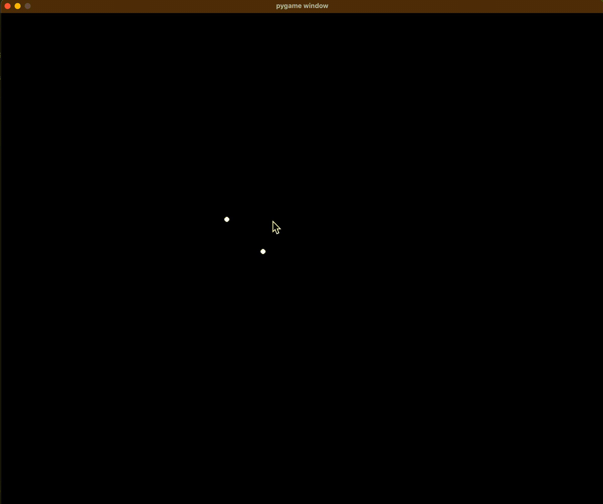
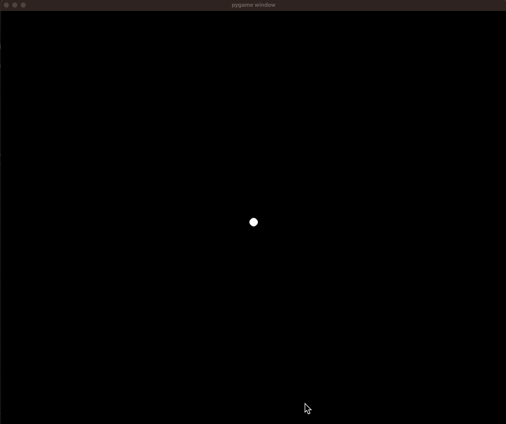
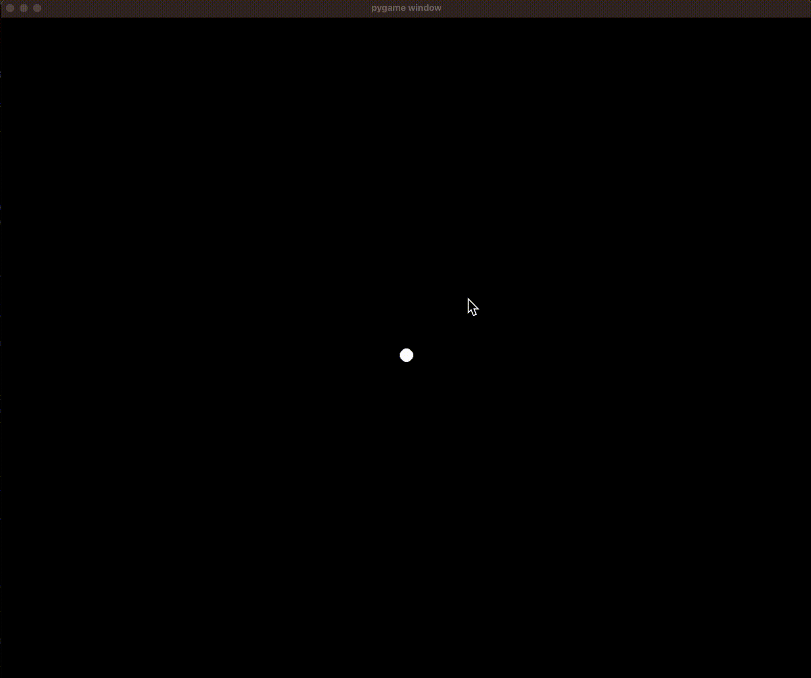

# 2D Gravity Physics Sim

> The goal of this project is to create a simple, fun, interactive simulation to observe how N amount of objects with radius R and density D interact with eachother's gravitational pull.

#### Left click anywhere on the pygame screen to add a ball, and see how they interact!

## Demo Video:

  
  

Video of Movable Center Mass (LEFT)   Video of Stationary Center Mass (RIGHT)

## Version 2 Optimizations and Updates:
* Switched from Euler integration to Verlet int
* Stored mass in ball class to save computation
* Fixed incorrect mass calculation, previously had m = d/v when in reality it is m = d*v
* Implemented dt variable instead of constant like 0.016s (1/60, 60fps) so we can determine actual time passed as # each loop wont be perfectly same amount of time of 0.016s
* Organized control code into main()
* Added collsion with walls constant "B" representing Bounce factor
* Added optional high density mass, can be configured by user thru terminal. User can configure the density, and whether or not it is stationary. (if it is affected by surrounding ball's gravity or not)
